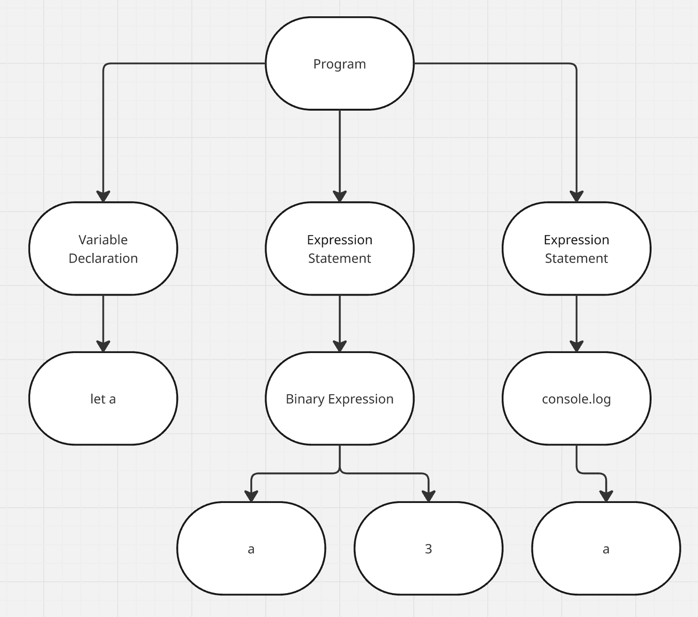

# 問題 2.8

## ソースコード1
###　ソースコード
``` javascript
let a
a
=
3
console.log(a)
```

###　JSON
Node {
  type: 'Program',
  start: 0,
  end: 26,
  body: [
    Node {
      type: 'VariableDeclaration',
      start: 0,
      end: 5,
      declarations: [Array],
      kind: 'let'
    },
    Node {
      type: 'ExpressionStatement',
      start: 6,
      end: 11,
      expression: [Node]
    },
    Node {
      type: 'ExpressionStatement',
      start: 12,
      end: 26,
      expression: [Node]
    }
  ],
  sourceType: 'script'
}

## ソースコード2
``` javascript
let a; a = 3; console.log(a);
```
###　JSON
Node {
  type: 'Program',
  start: 0,
  end: 29,
  body: [
    Node {
      type: 'VariableDeclaration',
      start: 0,
      end: 6,
      declarations: [Array],
      kind: 'let'
    },
    Node {
      type: 'ExpressionStatement',
      start: 7,
      end: 13,
      expression: [Node]
    },
    Node {
      type: 'ExpressionStatement',
      start: 14,
      end: 29,
      expression: [Node]
    }
  ],
  sourceType: 'script'
}


## 図

