# 設問13-2

## 問題
以下の各関数 `f3` から `f12` までを実行すると何が出力されるか予想し実際に確認しなさい。
またその理由を 2、3 行のテキスト、図のいずれかまたは両方で説明しなさい。テキスト・図は f1 の解答例を参考にしなさい。

## 回答
### f3

```js
function f3() {
  // NOTE: then のコールバック内の例外は try/catch でキャッチできるだろうか
  try {
    wait(0).then(logA).then(errX);
  } catch (e) {
    logB();
  } finally {
    logC();
  }
}
```
回答：
C が出力され、ほぼ同時に A が出力される。
その後、キャッチされない例外 X が発生する。B は出力されない。

解説：
try...catch 構文は、.then() のコールバックのような非同期処理の中で発生した例外をキャッチできない。
そのため errX による例外はキャッチされず logB は実行されない。
finally ブロックは同期的コードの一部として即座に実行される。

```mermaid
gantt
  title f3
  dateFormat s
  axisFormat %S
  logC  :c, 0, 0.1s
  wait0 :w0, 0, 0s
  logA  :a, after w0, 0.1s
  errX (unhandled) :ex, after a, 0.1s
```



#### f4
```js
function f4() {
  // NOTE: f5 との比較用
  wait2()
    .then(() => {
      logA();
      return 40;
    })
    .then((value) =>
      wait(1000).then(() => {
        logB();
        return 100;
      })
    )
    .then((v) => log(v));
}
```

回答:
2秒後に A が出力され、その1秒後に B、直後に 100 が出力される。

説明:
Promiseチェーンが順番に実行される。
2つ目の .then は新しいPromise (wait(1000).then(...)) を返しているため、チェーンはそのPromiseが解決されるまで待機する。
最後の .then は、その解決値である 100 を受け取って出力します。

```mermaid
gantt
  title f4
  dateFormat s
  axisFormat %S
  wait2 :w2, 0, 2s
  logA  :a, after w2, 0.1s
  wait1 :w1, after a, 1s
  logB  :b, after w1, 0.1s
  log100:l100, after b, 0.1s
```



#### f5
```js
function f5() {
  // NOTE: 2つ目の then の引数が関数でなく Promise になっている (典型的なミス)
  wait2()
    .then(() => {
      logA();
      return 40;
    })
    .then(
      wait1().then(() => {
        logB();
        return 100;
      })
    )
    .then((v) => log(v));
}
```
回答:
約1秒後に B、約2秒後に A、その直後に 40 が出力される。

説明:
2つ目の .then の引数が関数ではなくPromiseオブジェクトになっている。
この場合、.then は実質的に無視され、前のPromiseの解決値 (40) がそのまま次の .then に渡される。
また、wait2() と .then の引数内で呼び出される wait1() は並行して実行される。

```mermaid
gantt
  title f5
  dateFormat s
  axisFormat %S
  wait1 :w1, 0, 1s
  logB  :b, after w1, 0.1s
  wait2 :w2, 0, 2s
  logA  :a, after w2, 0.1s
  log40 :l40, after a, 0.1s
```



#### f6
```js
function f6() {
  // NOTE: 1つの Promise に対し then を2回呼び出すとどうなるか

  const p = wait1().then(logA);
  p.then(() => wait1()).then(logB);
  p.then(() => wait2()).then(logC);
}
```
回答:
1秒後に A、その1秒後に B、さらにその1秒後に C が出力される。

説明:
1つのPromise p に対して複数の .then を呼び出すと、p が解決された後、登録されたコールバックは並行して実行を開始する。
それぞれのチェーン (p->B, p->C) は独立して進行する。

```mermaid
gantt
  title f6
  dateFormat s
  axisFormat %S
  wait1_p :w1p, 0, 1s
  logA    :a, after w1p, 0.1s

  section Chain for B
  wait1_b :w1b, after a, 1s
  logB    :b, after w1b, 0.1s

  section Chain for C
  wait2_c :w2c, after a, 2s
  logC    :c, after w2c, 0.1s
```




#### f7
```js
function f7() {
  // NOTE: 2つ目の wait の引数が実行される差には p は解決済み
  // (= 解決済みの Promise の then を呼び出すとどうなるか)
  const p = wait1().then(logA);
  wait2()
    .then(() => {
      return p.then(logB);
    })
    .then(logC);
}
```
回答:
1秒後に A、その1秒後に B、直後に C が出力される。

説明:
wait1() と wait2() は並行して開始される。
wait2() が完了する2秒後には、p は既に解決済みである。
解決済みのPromiseに対して .then を呼び出すと、コールバックは即座にスケジュールされ、logB、logCが連続して実行される。


#### f8
```js
function f8() {
  // NOTE: f9, f10 との比較用
  wait1()
    .then(errX)
    .then(errY)
    .catch((e) => log(e.message))
    .finally(logA);
}
```
回答:
1秒後に X、その直後に A が出力される。

説明:
最初の .then(errX) で例外が発生し、Promiseが rejected 状態になる。
後続の .then(errY) はスキップされ、.catch ブロックがその例外を捕捉して X を出力する。
finallyはPromiseの状態に関わらず最後に実行される。

```mermaid
gantt
  title f8
  dateFormat s
  axisFormat %S
  wait1 :w1, 0, 1s
  errX  :ex, after w1, 0.1s
  catchX:cx, after ex, 0.1s
  logA  :a, after cx, 0.1s
```



#### f9
```js
function f9() {
  // NOTE: f10 との比較用
  wait1()
    .then(() => 42)
    .then(errY)
    .catch((e) => log(e.message))
    .finally(logA);
}
```
回答:
1秒後に Y、その直後に A が出力される。

説明:
2つ目の .then(errY) で例外が発生し、Promiseが rejected 状態になる。
後続の .catch ブロックがその例外を捕捉して Y を出力する。
finallyは最後に必ず実行される。

```mermaid
gantt
  title f9
  dateFormat s
  axisFormat %S
  wait1 :w1, 0, 1s
  then42:t42, after w1, 0.1s
  errY  :ey, after t42, 0.1s
  catchY:cy, after ey, 0.1s
  logA  :a, after cy, 0.1s
```



#### f10
```js
function f10() {
  // NOTE: then(r, c) と then(r).catch(c) は等しいか？
  wait1()
    .then(() => 42)
    .then(errY, (e) => log(e.message))
    .finally(logA);
}
```
回答:
1秒後に A が出力され、その後に未捕捉の例外 Uncaught (in promise) Error: Y が発生する。

説明:
then(onFulfilled, onRejected) の onRejected は、前のPromiseが失敗した場合にのみ実行される。
この場合、成功コールバックである errY の中で発生した例外は、同じ .then の失敗コールバックでは捕捉できず、後続に .catch もないため未捕捉となる。

```mermaid
gantt
  title f10
  dateFormat s
  axisFormat %S
  wait1 :w1, 0, 1s
  then42:t42, after w1, 0.1s
  errY (unhandled) :ey, after t42, 0.1s
  logA  :a, after ey, 0.1s
```



#### f11
```js
function f11() {
  // f12 との比較用: new Promise 内の throw は .catch でキャッチできるか？
  new Promise((resolve, reject) => {
    errX();
  }).catch((e) => log(e.message));
}
```
回答:
即座に X が出力される。

説明:
new Promise のコンストラクタに渡すexecutor関数内で同期的にスローされた例外は、Promiseによって自動的に捕捉され、そのPromiseは rejected 状態になる。この rejected は後続の .catch で処理される。

```mermaid
gantt
  title f11
  dateFormat s
  axisFormat %S
  errX  :ex, 0, 0.1s
  catchX:cx, after ex, 0.1s
```



#### f12
```js
function f12() {
  // new Promise 内だがコールバック関数で throw した場合は？
  new Promise((resolve, reject) => {
    setTimeout(() => errX(), 0);
  }).catch((e) => log(e.message));
}
```
回答:
未捕捉の例外 Uncaught Error: X が発生する。

説明:
Promiseのexecutor内から非同期（setTimeoutのコールバックなど）でスローされた例外は、Promiseのコンテキスト外で発生するため、.catch では捕捉できない。

```mermaid
gantt
  title f12
  dateFormat s
  axisFormat %S
  setTimeout callback (unhandled error) :cb, 0, 0.1s
```

