# 設問13-7
## 問題
以下の各関数を実行すると何が出力されるか予想し実際に確認しなさい。
またその理由を 2、3 行のテキスト、図のいずれかまたは両方で説明しなさい。テキスト・図は問題 13.2 を参考にしなさい。

## 回答
### h1

```js
async function h1() {
  try {
    await wait3();
    logA();
    await wait2();
    logB();
    await wait1();
    logC();
  } catch (e) {
    log(e.message);
  }
}

```
回答：
実行後3秒でAが表示され、その2秒後にBが表示され、1秒後にCが表示される。

解説：
async/await構文により、各await式が完了するまで後続の処理が待機される。
そのため、wait3()で3秒、wait2()で2秒、wait1()で1秒と、処理が順番に実行される。

```mermaid
gantt
  title h1 関数の処理フロー
  dateFormat  s
  axisFormat %Ss
  section 処理
  3秒待機     :p1, 0, 3s
  "A"を出力   :outA, after p1, 0.1s
  2秒待機     :p2, after p1, 2s
  "B"を出力   :outB, after p2, 0.1s
  1秒待機     :p3, after p2, 1s
  "C"を出力   :outC, after p3, 0.1s
```



### h2
```js
function h2() {
  // NOTE: h3 との比較用
  new Promise(() => {
    errX();
  }).catch((e) => log(e.message));
}
```
回答：
errXが出力される。

解説
new Promise内でエラーはスローされると、Promiseはrejected状態になる。
この状態は後続のcatchで捕捉され。エラーメッセージXが出力される。

### h3
```js
function h3() {
  // NOTE: new Promise の引数が async function の場合、例外はどう扱われるだろう
  new Promise(async () => {
    errX();
  }).catch((e) => log(e.message));
}
```
回答：
errXが出力される。

解説：
Promiseのコンストラクタにasync関数を渡した場合でも、h2と同様になる。
async関数内で発生した例外を検知し、Promise自体をrejected状態にする。
結果として、.catchないで例外が捕捉されている。

### h4
```js
async function h4() {
  // NOTE: 2つの例外は両方 catch できるか？
  try {
    const p1 = wait2().then(() => {
      errX();
    });
    const p2 = wait1().then(() => {
      errY();
    });
    await p1;
    await p2;
  } catch (e) {
    log(e.message);
  }
}
```
回答：
errYが出力される。

解説：
p2のエラーが発生した時点でcatchされ、p1のプロセスが終了している。
そのため、p2のerrYのみが表示される。
